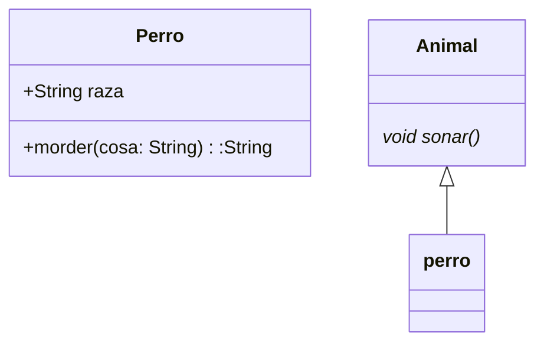

```java
abstract class animal{
void alimentar(){
}
abstract void sonar();

}


class perro extends Animal{
String raza;

String morder(String cosa)
return null;
}
```


```mermaid
classDiagram
class Perro{

        +String raza
        +morder(cosa: String):String        
}

class Animal {
  void sonar()*
}

Animal <|-- perro

```

